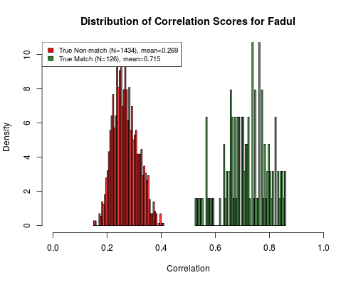

<!-- README.md is generated from README.Rmd. Please edit that file -->
cartridges3D
============

`cartridges` adapted for 3D topographies.

Installation
------------

You can install `cartridges3D` from github with:

``` r
# install.packages("devtools")
devtools::install_github("xhtai/cartridges3D")
```

Usage
-----

This is an example of how to use the code. First we pre-process the data, selecting breechface marks using RANSAC, leveling the image, removing circular symmetry and filtering the image. Next in the alignment step we need to find rotation and translation parameters -- this can be done using brute force or using the Lucas-Kanade algorithm. The former is more accurate but slower.

The following is some example code for running this on multiple images.

Pre-processing:

``` r
library(cartridges3D)
fileList <- system("ls /media/xtai/4AF561E807105059/3D/data/Fadul/cc/*.x3p", intern = TRUE)

basis701 <- getBasisFunctions(701) # just run this once
for (i in 1:length(fileList)) {
    cat(i, ", ")
    processed <- allPreprocess3D(fileList[i])
    outName <- sub(".x3p", ".Rdata", fileList[i])
    outName <- sub("/cc/", "/processed_9-22/", outName)
    save(processed, file = outName)
}
```

Comparisons:

``` r
fileList <- system("ls /media/xtai/4AF561E807105059/3D/data/Fadul/processed_9-22/*.Rdata", intern = TRUE)

allPairwise <- function(imageName) {
    load(imageName)
    newImage <- processed
    out <- data.frame(compare = fileList, corr = NA, dx = NA, dy = NA, theta = NA, stringsAsFactors = FALSE)
    index <- which(out$compare == imageName)
    out <- out[-index, ]
    for (i in 1:nrow(out)) {
        #cat(i, ", ")
        load(out$compare[i])
        out[i, 2:5] <- calculateCCFmaxNew(processed, newImage) # new image gets rotated
    }
    return(out)
}

Sys.time()
for (j in 1:length(fileList)) {
    cat(j, ", ")
    compare <- allPairwise(fileList[j])
    outName <- sub("/processed_9-22/", "/results_9-24/", fileList[j])
    save(compare, file = outName)
}
Sys.time()
```

Results
-------

These are example results using the Fadul data set.



License
-------

The `cartridges3D` package is licensed under GPLv3 (<http://www.gnu.org/licenses/gpl.html>).
