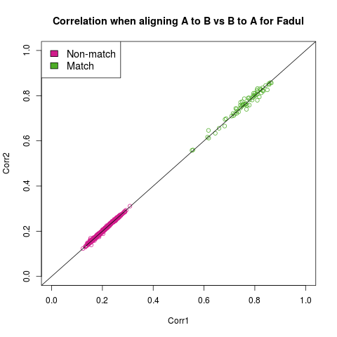
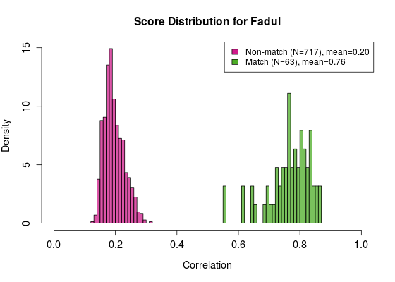
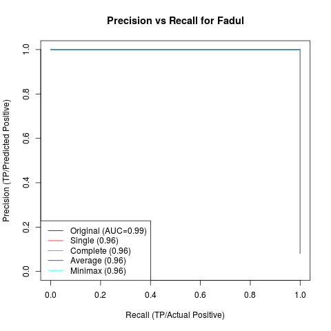

<!-- README.md is generated from README.Rmd. Please edit that file -->
cartridges3D
============

`cartridges` adapted for 3D topographies.

2D versus 3D data and methodology
---------------------------------

2D and 3D data differ in that the two measure different properties of the same physical object: 2D images record reflectance while 3D topographies record surface contours directly. While 2D images are a matrix of intensity values, 3D topographies are a matrix of depth values, stored in an x3p (XML 3-D Surface Profile) file (see <https://sourceforge.net/p/open-gps/mwiki/X3p/>). This is a container format, containing a matrix of depth values, together with associated metadata, including the instrument and lateral resolution used to capture the topography.

2D and 3D data differ in some other characteristics. The 2D data in NIST's database are all of the same dimension and resolution, while the 3D data are of varying dimensions and resolutions. The dimensions are 600 × 600, 1200 × 1200, or 2500 × 2500, corresponding to lateral resolutions of 6.25 microns, 3.12 microns, and 1.56 microns respectively. Lenses with different magnifications were used for different measurements, and some images were downsampled before being uploaded into the database. (For example the 1.56 micron resolution images are taken using a 20X objective with no downsampling, while the 3.12 micron resolution images could be a 20X objective downsampled by half, or using a 10X objective.) Another difference between 2D and 3D data is the presence of dropouts. When there is a large change in depth, for example a steep slope at the walls of the firing pin impression, the measuring instrument is unable to capture the depth values accurately and they are recorded as missing or NA values. These points are important to note as they affect the subsequent pre-processing.

The methodology for analyzing 2D data is in Tai and Eddy (2018). There are a few differences for 3D data. For example, to standardize the different resolutions we resize all images to the lowest resolution of 6.25 microns. Second, we use a different procedure for automatic selection of breechface marks. The comparison procedure is the same as for 2D, however the resolution used for comparisons is 25 microns, compared to the 10 microns for 2D images. The result is that comparisons run much quicker. The only major difference in methodology is in the selection of breechface marks, which we describe in more detail as follows.

For 2D data we used edge detection and image processing operations to select the breechface marks. In 3D, we are able to make use of physical characteristics to achieve better performance. The breechface region is relatively flat and has low depth, while the firing pin impression, being an indentation on the primer surface, is typically much deeper. The solution then is to fit a plane through the breechface region, ignoring the firing pin impression, and to select only points lying on or close to the plane.

To achieve this, we use an algorithm called RANdom SAmple Consensus (RANSAC) (Fischler and Bolles 1981), which is designed to fit models in the presence of outliers. Briefly, we repeatedly fit planes by sub-sampling points, and choose the plane with the largest number of inliers, defined as points within a selected threshold from the fitted plane. Points within the selected threshold are determined to be part of the breechface area.

Installation
------------

You can install `cartridges3D` from github with:

``` r
# install.packages("devtools")
devtools::install_github("xhtai/cartridges3D")
```

Usage
-----

This is an example of how to use the package. First we pre-process the data, selecting breechface marks using RANSAC, leveling the image, removing circular symmetry and filtering the image. Next in the alignment step we need to find rotation and translation parameters -- this can be done using a grid search.

The following is some example code for running this on multiple images.

Pre-processing:

``` r
library(cartridges3D)
fileList <- system("ls /media/xtai/4AF561E807105059/3D/data/Fadul/cc/*.x3p", intern = TRUE)

basis701 <- getBasisFunctions(701) # just run this once
for (i in 1:length(fileList)) {
    cat(i, ", ")
    processed <- allPreprocess3D(fileList[i])
    outName <- sub(".x3p", ".Rdata", fileList[i])
    outName <- sub("/cc/", "/processed_9-22/", outName)
    save(processed, file = outName)
}
```

Comparisons:

``` r
fileList <- system("ls /media/xtai/4AF561E807105059/3D/data/Fadul/processed_9-22/*.Rdata", intern = TRUE)

allPairwise <- function(imageName) {
    load(imageName)
    newImage <- processed
    out <- data.frame(compare = fileList, corr = NA, dx = NA, dy = NA, theta = NA, stringsAsFactors = FALSE)
    index <- which(out$compare == imageName)
    out <- out[-index, ]
    for (i in 1:nrow(out)) {
        #cat(i, ", ")
        load(out$compare[i])
        out[i, 2:5] <- calculateCCFmaxSearch(processed, newImage) # new image gets rotated
    }
    return(out)
}

Sys.time()
for (j in 1:length(fileList)) {
    cat(j, ", ")
    compare <- allPairwise(fileList[j])
    outName <- sub("/processed_9-22/", "/results_9-24/", fileList[j])
    save(compare, file = outName)
}
Sys.time()
```

Consolidating results and removing duplicates:

``` r
load("./allMetadata_3-17-2019.Rdata")
metadata$rdataName3D <- paste0(metadata$X3Dfilename, ".Rdata")

fileList <- system("ls *.Rdata", intern = TRUE)

allResults <- c()
for (i in 1:(length(fileList))) {
    load(fileList[i])
    compare$newImage <- fileList[i]

    allResults <- rbind(allResults, compare)
}
allResults <- dplyr::left_join(allResults, metadata[, c("rdataName3D", "GunNumber")], by = c("compare" = "rdataName3D"))
names(allResults)[length(names(allResults))] <- "compareGun"
allResults <- dplyr::left_join(allResults, metadata[, c("rdataName3D", "GunNumber")], by = c("newImage" = "rdataName3D"))
names(allResults)[length(names(allResults))] <- "newGun"

allResults$match <- as.numeric(allResults$compareGun == allResults$newGun)

######################## A-B vs B-A ######################### 
removedDups <- removeDups(allResults, "corr")
```

Calculate precision and recall:

``` r
fg <- removedDups$corrMax[removedDups$match == 1]
bg <- removedDups$corrMax[removedDups$match == 0]
# PR Curve
pr <- PRROC::pr.curve(scores.class0 = fg, scores.class1 = bg, curve = TRUE)
pr <- pr$x
names(pr) <- c("recall", "precision", "cutoff")
```

Hierarchical clustering:

``` r
cutoffs <- seq(from = 0, to = 1, by = .01) 
for (i in 1:length(cutoffs)) { 
    removedDups[paste0("single", cutoffs[i])] <- linksAnalysis(removedDups, "corrMax", cutoffs[i], "single", "compare", "newImage")
    removedDups[paste0("complete", cutoffs[i])] <- linksAnalysis(removedDups, "corrMax", cutoffs[i], "complete", "compare", "newImage")
    removedDups[paste0("average", cutoffs[i])] <- linksAnalysis(removedDups, "corrMax", cutoffs[i], "average", "compare", "newImage")
    removedDups[paste0("minimax", cutoffs[i])] <- linksAnalysis(removedDups, "corrMax", cutoffs[i], "minimax", "compare", "newImage")
}

########### precision-recall
precRecall <- data.frame(link = rep(c("single", "complete", "average", "minimax"), each = length(cutoffs)), cutoff = rep(cutoffs, 4), precision = NA, recall = NA, stringsAsFactors = FALSE)

for (i in 1:nrow(precRecall)) {
    numerator <- sum(removedDups[paste0(precRecall$link[i], precRecall$cutoff[i])] >= .5 & removedDups$match == 1) # preds are 0 or 1 so doesn't matter that i used .5
    denom <- sum(removedDups[paste0(paste0(precRecall$link[i], precRecall$cutoff[i]))] >= .5)
    if (denom == 0) {
        precRecall$precision[i] <- 1
    } else {
        precRecall$precision[i] <- numerator/denom
    }
    precRecall$recall[i] <- numerator/sum(removedDups$match == 1)
}
```

Getting final clusters:

``` r
finalClusters <- getClust(removedDups, "minimax0.4", "compare", "newImage")
```

Results
-------

These are example results using the Fadul data set.



 

License
-------

The `cartridges3D` package is licensed under GPLv3 (<http://www.gnu.org/licenses/gpl.html>).

References
----------

Fischler, Martin A., and Robert C. Bolles. 1981. “Random Sample Consensus: A Paradigm for Model Fitting with Applications to Image Analysis and Automated Cartography.” *Commun. ACM* 24 (6). New York, NY, USA: ACM: 381–95. doi:[10.1145/358669.358692](https://doi.org/10.1145/358669.358692).

Tai, Xiao Hui, and William F. Eddy. 2018. “A Fully Automatic Method for Comparing Cartridge Case Images,” *Journal of Forensic Sciences* 63 (2): 440–48. doi:[10.1111/1556-4029.13577](https://doi.org/10.1111/1556-4029.13577).
